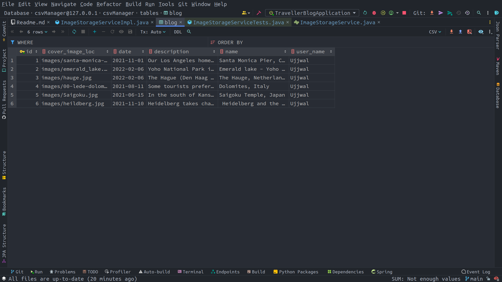
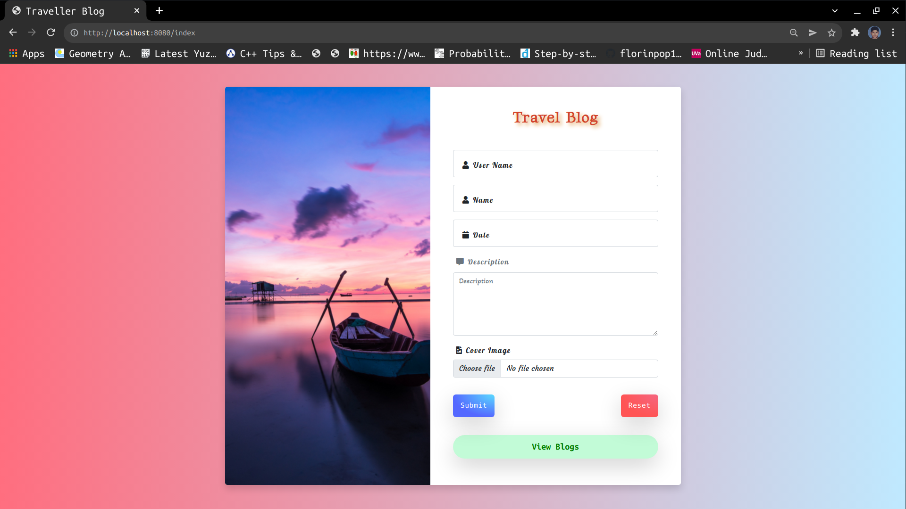
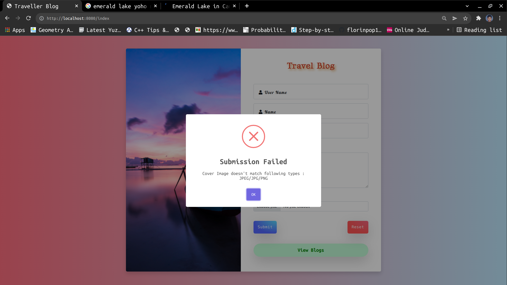

# Travel Blog Application using Spring Boot

<div style="padding:10px;font-family: 'Montserrat', sans-serif;">
Web Application developed using <span style="font-family: cursive; font-weight: 500; font-style: italic">Java Spring framework, Hibernate, MYSQL, Thymeleaf and HTML </span>. The Application design pattern follows 
MVC (Model-View-Controller) architecture. 

To view the demonstration video on using this website refer:  [DEMO](https://drive.google.com/file/d/1MrAKUD5_BVbIv5VhjS3wNYh4vcC06yZI/view?usp=sharing)

    The database after demonstration is as follows

<div>
    
</div>
</div>

## Directory structure

```
 📦src
 ┣ 📂main
 ┃ ┣ 📂java
 ┃ ┃ ┗ 📂com.example.travellerblog
 ┃ ┃     ┣ 📂controller
 ┃ ┃     ┃ ┣ 📜BlogController.java
 ┃ ┃     ┃ ┣ 📜BlogItemController.java
 ┃ ┃     ┃ ┗ 📜MainController.java
 ┃ ┃     ┣ 📂model
 ┃ ┃     ┃ ┗ 📜Blog.java
 ┃ ┃     ┣ 📂repository
 ┃ ┃     ┃ ┗ 📜BlogRepository.java
 ┃ ┃     ┣ 📂service
 ┃ ┃     ┃ ┣ 📜BlogService.java
 ┃ ┃     ┃ ┣ 📜BlogServiceImpl.java
 ┃ ┃     ┃ ┣ 📜ImageStorageService.java
 ┃ ┃     ┃ ┗ 📜ImageStorageServiceImpl.java
 ┃ ┃     ┣ 📂utils
 ┃ ┃     ┃ ┣ 📜BlogForm.java
 ┃ ┃     ┃ ┗ 📜BlogItemTemplate.java
 ┃ ┃     ┗ 📜TravellerBlogApplication.java
 ┃ ┃
 ┃ ┗ 📂resources
 ┃ ┃ ┣ 📂static
 ┃ ┃ ┃ ┣ 📂assets
 ┃ ┃ ┃ ┃ ┣ 📜bcg.jpg
 ┃ ┃ ┃ ┃ ┗ 📜bg-inner.png
 ┃ ┃ ┃ ┃
 ┃ ┃ ┃ ┗ 📂styles
 ┃ ┃ ┃ ┃ ┣ 📜blogItem.css
 ┃ ┃ ┃ ┃ ┣ 📜blogItemEdit.css
 ┃ ┃ ┃ ┃ ┣ 📜blogList.css
 ┃ ┃ ┃ ┃ ┗ 📜index.css
 ┃ ┃ ┃ ┃
 ┃ ┃ ┣ 📂templates
 ┃ ┃ ┃ ┣ 📜blogItem.html
 ┃ ┃ ┃ ┣ 📜blogItemEdit.html
 ┃ ┃ ┃ ┣ 📜blogList.html
 ┃ ┃ ┃ ┣ 📜error.html
 ┃ ┃ ┃ ┗ 📜index.html
 ┃ ┃ ┃
 ┃ ┃ ┗ 📜application.properties
 ┃ ┃
 ┗ 📂test
 ┃ ┗ 📂java
 ┃ ┃ ┗ 📂com.example.travellerblog
 ┃ ┃   ┣ 📜ImageStorageServiceTests.java
 ┃ ┃   ┗ 📜TravellerBlogApplicationTests.java          

```

## Module Info

This spring application is dependent on following module.

``` java
    module TravellerBlog {

        requires java.persistence;
        requires commons.fileupload;
        requires org.apache.commons.io;
        requires spring.beans;
        requires spring.boot.autoconfigure;
        requires spring.boot.devtools;
        requires spring.context;
        requires spring.data.commons;
        requires spring.data.jpa;
        requires spring.web;
        requires spring.webmvc;
}
```

## Building this Project

Simply clone this project, then open the project in your favourite IDE,
the maven building of the project will be automatically done by the IDE. After opening in your IDE configure ```resources/application.properties``` to configure local MYSQL url in database url and then we are ready to run the project in our local system.

## Output and Features

### Index Page
<div>
    
</div>

The index or the home page of the website has a travel blog form with following fields
* **User Name:** Name of the user to whom the blog belongs ****(max 100 characters)****; later using this name we can access all the blog belonging to this person.
* **Name** Travel Name you want to dedicated this blog to
* **Date** Travel Date
* **Description** Description related to the blog
* **Cover Image** Image file you want to associate this blog to (Only supports JPEG/PNG/JPG)

#### validation popup
<div style="padding: 5px">
    

</div>

After submitting the form based on validation message we will get popup notifying if there was error or was successful.


### Blog List Page

If one wishes to view the blog saved by the respective user, click on ***View Blogs** buttons and enter the ***User Name** and this will
take you to the blog list page.

The Blog List page contains card layout with each card dedicated to individual blog item. Each card on top right corner has
***view**, ***edit** and ***delete** button.


### View Page

On clicking **view*** button the view page for that blog Item is opened.


### Edit Page

On clicking **edit** button we are taken to the Edit Page, where a small form with old field data is present. The cover image
is present as background and on changing file the background also changes to reflect the same.


#### Edit page Background Image change


## Deletion Feature

On clicking delete button the card is removed from the list


